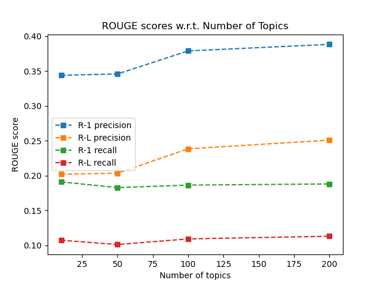

# AutoSurvey

## Requirements

* Python3 (3.6+ preferred)
* Anaconda3 (optional, but helpful for setup)

## Setup

Run the setup script provided (```cd scripts/ && ./setup.sh```) or follow the steps below to create the conda environment with dependencies installed, install auxiliary resources for dependencies, download a minimal dataset, and perform preprocessing.

```bash
# from root dir:

# create environment from file and activate it
# if you run into issues, using environment_verbose.yml may help for finding missing packages
conda env create --file environment.yml

conda activate autosurvey

# download a small set of research papers
# additional command line args available; to view, run as: python arxiv_fetch.py -h
python arxiv_fetch.py

# download and install spaCy language model
python -m spacy download en_core_web_sm

# preprocess the downloaded documents
cd summarize/ && python preprocess.py
```

**NOTE:** in our experiments, we used a dataset of 400 documents with topic tag `"text summarization"` for LDA training, and 3 of those documents (IDs 386, 251, and 113 in this repo) for testing summary generation. You can tweak these values (including number of papers downloaded and the general topic of 
each paper) by manually running `arxiv_fetch.py` in `scripts/` with the flags described.

## Running Experiments

Specify the documents you'd like to summarize by their document ID in `summarize/targets.txt` (see example in that file). Document IDs can be found in `summarize/ids.txt`, which is generated after downloading the articles.

Run the entire pipeline:

```bash
cd summarize/

# default: extracts 200 latent topics from corpus, summarizes only the documents specified in targets.txt
python pipeline.py

# custom: 50 topics, summarizes/computes scores for summaries of all documents in the training corpus
# NOTE: currently, the --all flag must be specified to log scores for plot generation
python pipeline.py --num_topics 50 --all
```

After you've run the pipeline for *different* configurations (i.e. different numbers of topics to extract), you can generate plots like so:

```bash
cd scripts/ && python generate_plots.py
```

**NOTE:** to graph, the file `run_logs.csv` must exist in `plots/`, and the topic numbers (listed in the first column in the file) should be unique.

### Pipeline Overview

Below is a diagram of our complete summarization pipeline. See `summarize/pipeline.py` for implementation.


## Preliminary Results

Here are the results from a sample run:

|     Doc     | ROUGE-1 Precision | ROUGE-L Precision | ROUGE-1 Recall | ROUGE-L Recall |
|:-----------:|:-----------------:|:-----------------:|:--------------:|:--------------:|
|  0 (target) |       0.560       |       0.360       |      0.097     |      0.062     |
|  1 (target) |       0.083       |       0.050       |      0.375     |      0.223     |
|  2 (target) |       0.384       |       0.219       |      0.275     |      0.157     |
|   Overall   |       0.201       |       0.082       |      0.488     |      0.198     |
| Alternative |       0.131       |       0.075       |      0.546     |      0.291     |
|   Average   |       0.342       |       0.210       |      0.249     |      0.148     |

And below, a plot of our results examining summarization performance with respect to the number of topics used during LDA model training:

