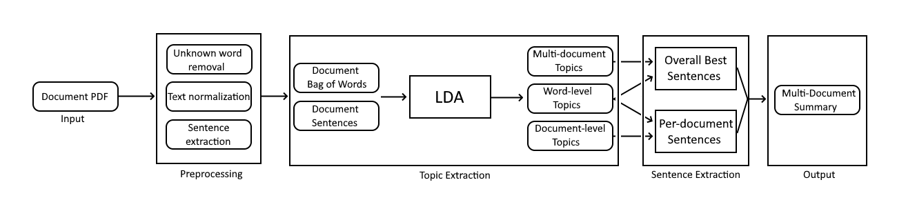

# AutoSurvey

## Requirements

* Python3 (3.6+ preferred)
* Anaconda3 (optional, but helpful for setup)

## Setup

Run the setup script provided (```cd scripts/ && ./setup.sh```) or follow the steps below to create the conda environment with dependencies installed, install auxiliary resources for dependencies, download a minimal dataset, and perform preprocessing.

```bash
# from root dir:

# create environment from file and activate it
# if you run into issues, using environment_verbose.yml may help for finding missing packages
conda env create --file environment.yml

conda activate autosurvey

# download a small set of research papers
# additional command line args available; to view, run as: python arxiv_fetch.py -h
python arxiv_fetch.py

# download and install spaCy language model
python -m spacy download en_core_web_sm

# preprocess the downloaded documents
cd summarize/ && python preprocess.py
```

**NOTE:** in our experiments, we used a dataset of 400 documents with topic tag `"text summarization"` for LDA training, and 3 of those documents for testing summary generation. You can tweak these values (including number of papers downloaded and the general topic of 
each paper) by manually running `arxiv_fetch.py` in `scripts/` with the flags described.

## Running Experiments

Specify the documents you'd like to summarize by their document ID in `summarize/targets.txt` (see example in that file). Document IDs can be found in `summarize/ids.txt`, which is generated after downloading the articles.

Run the entire pipeline:

```bash
cd summarize/
python pipeline.py
```

### Pipeline Overview

Below is a diagram of our complete summarization pipeline. See `summarize/pipeline.py` for implementation.


